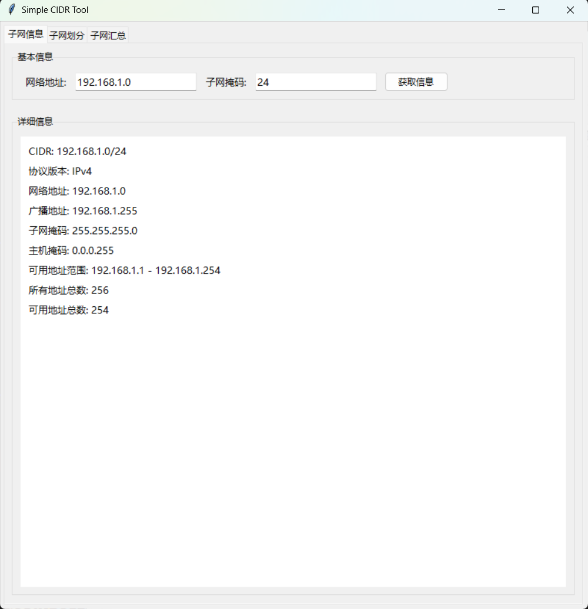
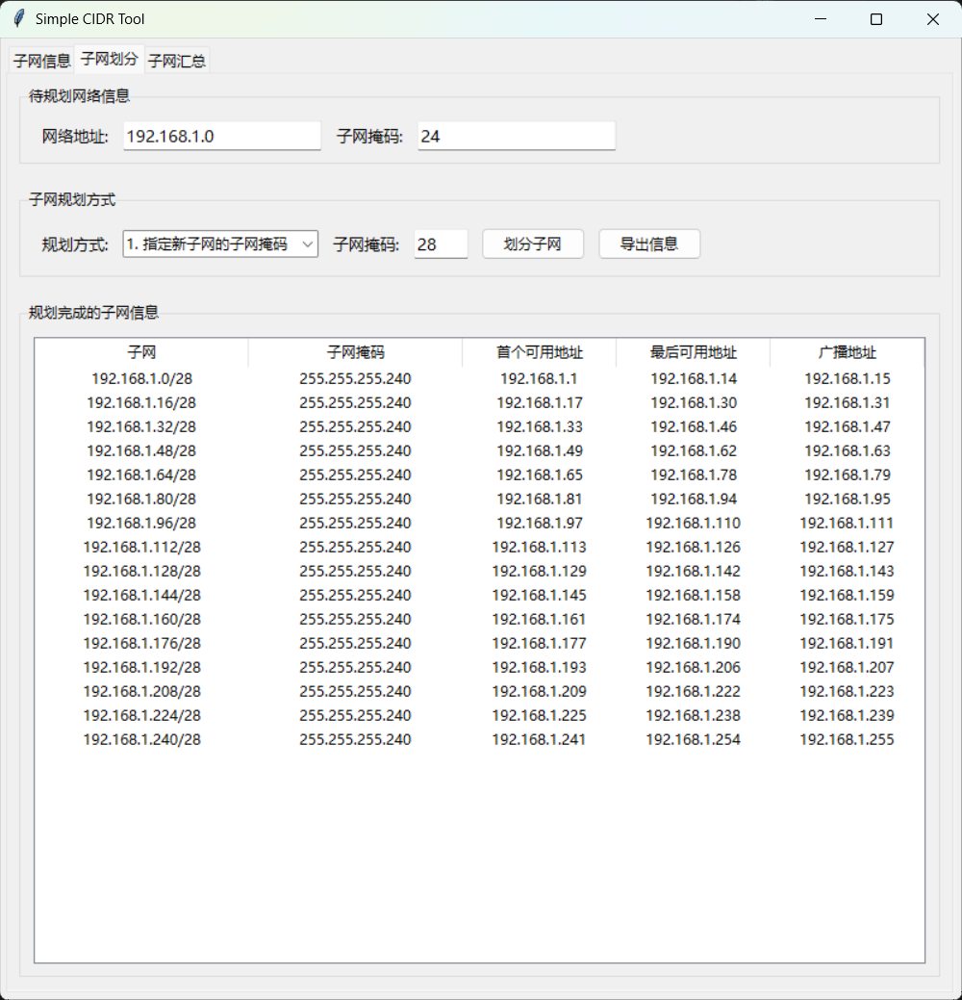
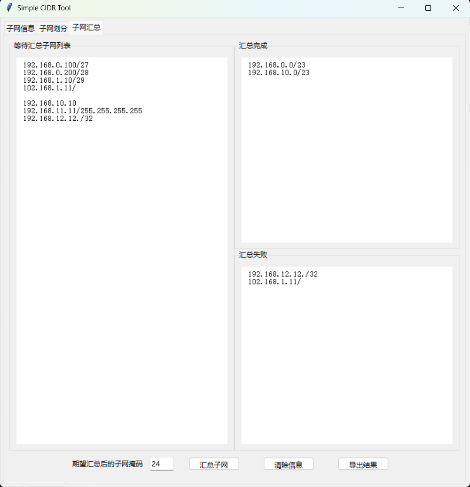

# SimpleCIDRTool

## 一、工具界面
### 子网信息查询

### 子网划分页面

### 子网汇总页面

## 二、使用方法
### 子网信息查询
1. 选择“子网信息”选项卡。
2. 输入网络地址和子网掩码，点击“获取信息”按钮。
3. 查看详细信息。

### 子网划分
1. 选择“子网划分”选项卡。
2. 输入待规划网络信息，选择子网规划方式，并输入相应的参数。
3. 点击“划分子网”按钮，查看划分结果。
4. 可以选择“导出信息”按钮，将汇总结果导出为CSV文件。

### 子网汇总
1. 选择“子网汇总”选项卡。
2. 输入待汇总的子网列表，并设置期望的汇总子网掩码。
3. 点击“汇总子网”按钮，查看汇总结果。
4. 可以选择“导出结果”按钮，将汇总结果导出为CSV文件。

## 三、注意事项
- 输入的网络地址和子网掩码必须符合CIDR标准。
- 在进行子网划分和汇总时，确保输入的参数合理，否则可能会得到错误的结果。